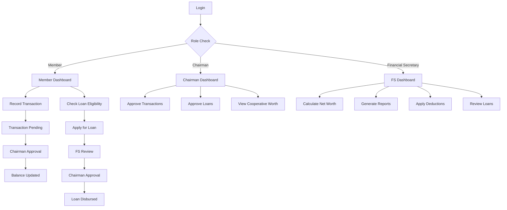

## 1. Product Overview
coopLedger is a secure, cloud-based web application that digitizes cooperative society financial operations, replacing manual WhatsApp and physical card-based systems. It automates member transactions, loan management, and financial reporting while providing real-time balance tracking and role-based access control.

The platform serves cooperative societies by streamlining financial operations, ensuring transparency, and reducing administrative workload by 70% through automated calculations and approval workflows.

## 2. Core Features

### 2.1 User Roles
| Role | Registration Method | Core Permissions |
|------|---------------------|------------------|
| Regular Member | Chairman invitation via email | Record transactions, view balance/history, check loan eligibility |
| Chairman | System admin assignment | All member features + approve transactions/loans, view cooperative worth, invite users |
| Financial Secretary | Chairman invitation via email | All member features + calculate net worth, generate reports, review loans |

### 2.2 Feature Module
Our cooperative financial management system consists of the following main pages:
1. **Dashboard**: Role-based overview with key metrics, notifications, and quick actions
2. **Transactions**: Record new transactions, view history, pending approvals
3. **Loan Management**: Apply for loans, view eligibility, track repayments, manage approvals
4. **Financial Reports**: Generate annual reports, member statements, analytics
5. **Member Management**: View member profiles, calculate net worth, manage deductions
6. **Settings**: Profile management, notification preferences

### 2.3 Page Details
| Page Name | Module Name | Feature description |
|-----------|-------------|---------------------|
| Login | Authentication | Secure login with email/password, session management |
| Dashboard | Metrics Overview | Display role-specific key metrics including balance, pending actions, notifications |
| Dashboard | Quick Actions | Provide shortcuts to common tasks based on user role |
| Dashboard | Notification Center | Show real-time alerts for transactions, approvals, due payments |
| Transactions | Record Transaction | Input form for date, amount, optional reference, bank transfer details |
| Transactions | Transaction History | Filterable list of all transactions with status indicators |
| Transactions | Pending Approvals | Chairman-only view to confirm/reject pending transactions |
| Loan Management | Loan Application | Form showing eligibility status and maximum loan amount |
| Loan Management | Repayment Schedule | Display 44-week payment plan with dates and amounts |
| Loan Management | Loan Tracking | Show progress, outstanding balance, next payment date |
| Loan Management | Approval Workflow | Financial Secretary review and Chairman approval process |
| Financial Reports | Annual Report Generator | Create comprehensive yearly financial reports in PDF/Excel |
| Financial Reports | Member Statements | Generate individual member account statements |
| Financial Reports | Analytics Dashboard | Visual charts for contributions, loans, penalties |
| Member Management | Net Worth Calculator | Calculate member eligibility with itemized deductions |
| Member Management | Deduction Management | Apply dues, fines, social contributions |
| Member Management | Member Directory | Searchable list of all members with key information |
| Member Management | User Invitation | Chairman-only feature to invite new members via email |
| Settings | Profile Settings | Update personal information and contact details |
| Settings | Notification Preferences | Configure email and in-app notification settings |
| Settings | Security Settings | Password change, session management |

## 3. Core Process

### Regular Member Flow
1. Member logs in and views dashboard with personal balance and notifications
2. Records new transaction after bank transfer - system creates pending status
3. Views transaction history and tracks confirmation status
4. Checks loan eligibility based on automated net worth calculation
5. Applies for loan within eligible amount - system generates repayment schedule
6. Makes weekly loan repayments as per schedule
7. Receives notifications for transaction confirmations and payment reminders

### Chairman Flow
1. Chairman accesses dashboard with pending approvals and cooperative metrics
2. Reviews pending transactions from members and confirms/rejects them
3. Approves loan applications after Financial Secretary review
4. Views cooperative total worth and financial overview
5. Monitors loan repayment status and missed payments
6. Receives alerts for new transactions and missed loan payments

### Financial Secretary Flow
1. Financial Secretary accesses comprehensive financial dashboard
2. Calculates member net worth for loan eligibility verification
3. Applies deductions (dues, fines, social contributions) to member accounts
4. Reviews loan applications and provides recommendations to Chairman
5. Generates financial reports (PDF/Excel) for annual summaries
6. Manages bulk operations for fines and meeting penalties

## 4. User Interface Design

### 4.1 Design Style
- **Primary Colors**: Green (#22c55e) for positive actions, Blue (#3b82f6) for primary elements
- **Secondary Colors**: Gray (#6b7280) for neutral elements, Red (#ef4444) for warnings/deletions
- **Button Style**: Rounded corners with subtle shadows, clear hover states
- **Font**: Inter for headings, system-ui for body text
- **Layout Style**: Card-based design with consistent spacing, top navigation bar
- **Icons**: Heroicons for consistency, Naira symbol (₦) for currency

### 4.2 Page Design Overview
| Page Name | Module Name | UI Elements |
|-----------|-------------|-------------|
| Dashboard | Metrics Cards | Clean cards with large numbers, green for positive values, currency formatting with ₦ |
| Dashboard | Notification Panel | Red badge counter, expandable panel with timestamped alerts |
| Transactions | Record Form | Simple 3-field form with date picker, amount input with ₦ prefix, optional reference field |
| Transactions | History Table | Sortable columns, status badges (Pending: yellow, Confirmed: green, Rejected: red) |
| Loan Management | Eligibility Display | Progress bar showing net worth vs loan amount, green for eligible, red for ineligible |
| Loan Management | Schedule Table | 44-row table with week numbers, due dates, amounts, payment status checkboxes |
| Financial Reports | Report Generator | Dropdown for report type, date range picker, format selection (PDF/Excel) |
| Member Management | Net Worth Calculator | Itemized deduction breakdown, final eligibility amount highlighted |

### 4.3 Responsiveness
Desktop-first design approach with mobile-responsive layouts. Touch-optimized interactions for mobile devices with appropriately sized buttons and form fields. Collapsible navigation menu for smaller screens. High accessibility standards with WCAG 2.1 AA compliance, keyboard navigation, screen reader support, and proper ARIA labels.

### 4.4 3D Scene Guidance
Not applicable - this is a financial management application with 2D data visualization charts and tables.

## 5. Non-Functional Requirements

### 5.1 Security Requirements
- **Role-Based Access Control (RBAC)**: Strict role-based permissions with Chairman as super-admin
- **Secure Authentication**: JWT-based authentication with refresh tokens, password hashing with bcrypt
- **Invite-Only Registration**: Users cannot self-register; must be invited by Chairman via email
- **Data Encryption**: Sensitive data encrypted at rest and in transit
- **Audit Logging**: All financial transactions logged with user attribution

### 5.2 Performance Requirements
- **Fast Search and Filtering**: Sub-second search results across all data tables
- **Responsive Design**: Page load time under 2 seconds on 3G connections
- **Scalability**: Support for 10,000+ members with horizontal scaling capability
- **High Availability**: 99.9% uptime with automated failover

### 5.3 Operational Requirements
- **Daily Automated Backups**: Automated daily backups with 30-day retention
- **Disaster Recovery**: Point-in-time recovery capability within 4 hours
- **Monitoring**: Real-time application performance monitoring and alerting
- **Accessibility**: WCAG 2.1 AA compliance, keyboard navigation, screen reader support

### 5.4 Compliance Requirements
- **Data Privacy**: GDPR compliance for member data protection
- **Financial Regulations**: Compliance with cooperative society financial reporting standards
- **Audit Trail**: Complete audit trail for all financial transactions and approvals