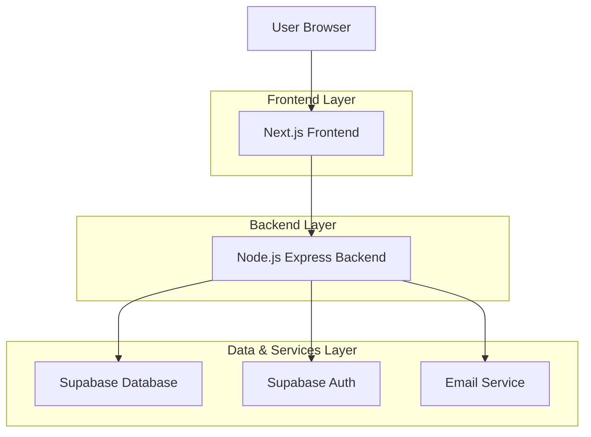
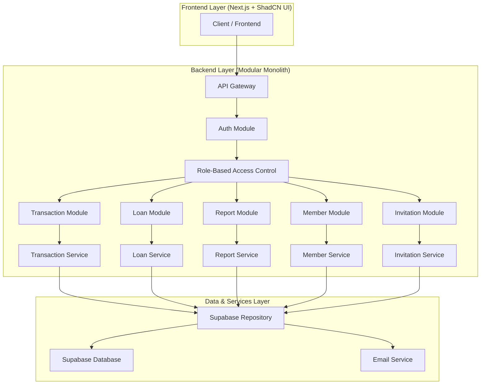
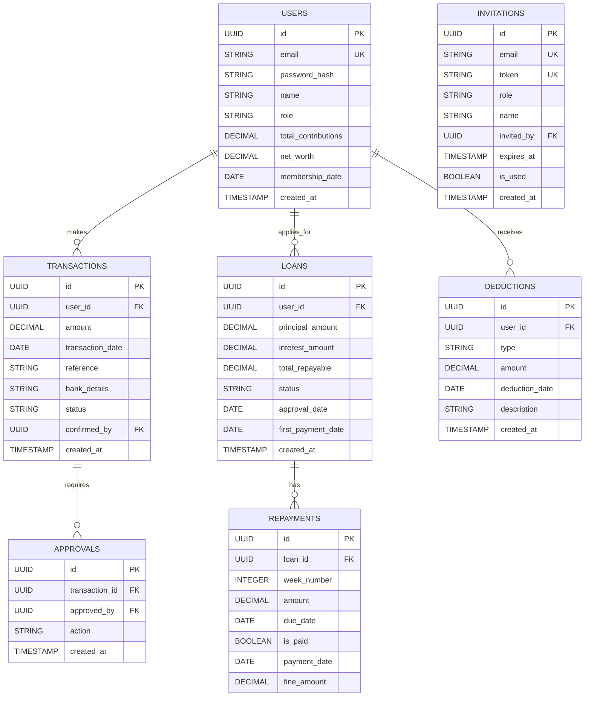

## 1. Architecture design



## 2. Technology Description
- Frontend: Next.js@14 + React@18 + TypeScript@5 + ShadCN UI
- Initialization Tool: create-next-app
- Backend: Node.js@20 + Express@4 + TypeScript@5 (Modular Monolith Architecture)
- Database: Supabase (PostgreSQL)
- Authentication: JWT-based with bcrypt (Invite-only system)
- File Generation: PDFKit + ExcelJS
- Email: Nodemailer with SMTP
- UI Components: ShadCN UI with Radix UI primitives
- Styling: Tailwind CSS v4 with custom design system

## 3. Route definitions
| Route | Purpose |
|-------|---------|
| / | Dashboard with role-based metrics and notifications |
| /login | User authentication page |
| /transactions | Transaction recording and history management |
| /transactions/pending | Chairman approval queue for pending transactions |
| /loans | Loan application and management interface |
| /loans/apply | Loan application form with eligibility check |
| /loans/repayments | Repayment schedule tracking |
| /loans/approvals | Loan approval workflow for admins |
| /reports | Financial report generation center |
| /members | Member directory and profile management |
| /members/net-worth | Net worth calculation tool |
| /settings | User profile and notification preferences |

## 4. API definitions

### 4.1 Authentication API
```
POST /api/auth/login
```
Request:
| Param Name | Param Type | isRequired | Description |
|------------|------------|------------|-------------|
| email | string | true | User email address |
| password | string | true | User password |

Response:
| Param Name | Param Type | Description |
|------------|------------|-------------|
| token | string | JWT authentication token |
| user | object | User profile with role information |
| role | string | User role (member/chairman/financial_secretary) |

```
POST /api/auth/invite
```
Request:
| Param Name | Param Type | isRequired | Description |
|------------|------------|------------|-------------|
| email | string | true | Email address to invite |
| role | string | true | Role to assign (member/financial_secretary) |
| name | string | true | Full name of invitee |

Response:
| Param Name | Param Type | Description |
|------------|------------|-------------|
| invitation_id | string | Unique invitation identifier |
| status | string | Invitation status |
| expires_at | string | Invitation expiry timestamp |

```
POST /api/auth/accept-invitation
```
Request:
| Param Name | Param Type | isRequired | Description |
|------------|------------|------------|-------------|
| invitation_token | string | true | Invitation token from email |
| password | string | true | New password for account |

Response:
| Param Name | Param Type | Description |
|------------|------------|-------------|
| user_id | string | Created user identifier |
| status | string | Account creation status |

### 4.2 Transaction API
```
POST /api/transactions
```
Request:
| Param Name | Param Type | isRequired | Description |
|------------|------------|------------|-------------|
| amount | number | true | Transaction amount in Naira |
| transaction_date | string | true | Date of transaction (ISO format) |
| reference | string | false | Optional transaction reference |
| bank_details | string | false | Bank transfer information |

Response:
| Param Name | Param Type | Description |
|------------|------------|-------------|
| transaction_id | string | Unique transaction identifier |
| status | string | Transaction status (pending/confirmed/rejected) |
| balance | number | Updated member balance |

### 4.3 Loan API
```
POST /api/loans/apply
```
Request:
| Param Name | Param Type | isRequired | Description |
|------------|------------|-------------|
| amount | number | true | Requested loan amount |
| purpose | string | false | Loan purpose description |

Response:
| Param Name | Param Type | Description |
|------------|------------|-------------|
| loan_id | string | Unique loan identifier |
| eligibility | boolean | Loan eligibility status |
| max_amount | number | Maximum eligible loan amount |
| repayment_schedule | array | 44-week payment schedule |

### 4.4 Reports API
```
GET /api/reports/annual
```
Request:
| Param Name | Param Type | isRequired | Description |
|------------|------------|-------------|
| year | number | true | Report year |
| format | string | true | Report format (pdf/excel) |

Response:
| Param Name | Param Type | Description |
|------------|------------|-------------|
| report_url | string | Download URL for generated report |
| generated_at | string | Report generation timestamp |

## 5. Server architecture diagram



## 6. Modular Monolith Architecture

### 6.1 Module Structure
The backend follows a modular monolith architecture with clear separation of concerns:

```
src/
├── modules/
│   ├── auth/
│   │   ├── controllers/
│   │   ├── services/
│   │   ├── repositories/
│   │   └── dto/
│   ├── transactions/
│   │   ├── controllers/
│   │   ├── services/
│   │   ├── repositories/
│   │   └── dto/
│   ├── loans/
│   │   ├── controllers/
│   │   ├── services/
│   │   ├── repositories/
│   │   └── dto/
│   ├── reports/
│   │   ├── controllers/
│   │   ├── services/
│   │   ├── repositories/
│   │   └── dto/
│   ├── members/
│   │   ├── controllers/
│   │   ├── services/
│   │   ├── repositories/
│   │   └── dto/
│   └── invitations/
│       ├── controllers/
│       ├── services/
│       ├── repositories/
│       └── dto/
├── shared/
│   ├── middleware/
│   ├── utils/
│   ├── types/
│   └── database/
└── config/
```

### 6.2 Module Communication
- **Inter-module communication** through well-defined service interfaces
- **Shared database** with proper schema isolation
- **Event-driven architecture** for cross-module notifications
- **Dependency injection** for loose coupling between modules

### 6.3 Scalability Benefits
- **Horizontal scaling**: Each module can be independently scaled
- **Lower operational cost**: Single deployment unit reduces infrastructure complexity
- **Maintainability**: Clear module boundaries enable independent development
- **Performance**: In-process communication eliminates network overhead

## 7. Data model

### 7.1 Data model definition


### 6.2 Data Definition Language

User Table (users)
```sql
-- create table
CREATE TABLE users (
    id UUID PRIMARY KEY DEFAULT gen_random_uuid(),
    email VARCHAR(255) UNIQUE NOT NULL,
    password_hash VARCHAR(255) NOT NULL,
    name VARCHAR(100) NOT NULL,
    role VARCHAR(20) NOT NULL CHECK (role IN ('member', 'chairman', 'financial_secretary')),
    total_contributions DECIMAL(12,2) DEFAULT 0,
    net_worth DECIMAL(12,2) DEFAULT 0,
    membership_date DATE NOT NULL,
    created_at TIMESTAMP WITH TIME ZONE DEFAULT NOW(),
    updated_at TIMESTAMP WITH TIME ZONE DEFAULT NOW()
);

-- create index
CREATE INDEX idx_users_role ON users(role);
CREATE INDEX idx_users_email ON users(email);

-- grant permissions
GRANT SELECT ON users TO anon;
GRANT ALL PRIVILEGES ON users TO authenticated;
```

Transactions Table (transactions)
```sql
-- create table
CREATE TABLE transactions (
    id UUID PRIMARY KEY DEFAULT gen_random_uuid(),
    user_id UUID NOT NULL REFERENCES users(id),
    amount DECIMAL(12,2) NOT NULL CHECK (amount > 0),
    transaction_date DATE NOT NULL,
    reference VARCHAR(100),
    bank_details TEXT,
    status VARCHAR(20) NOT NULL DEFAULT 'pending' CHECK (status IN ('pending', 'confirmed', 'rejected')),
    confirmed_by UUID REFERENCES users(id),
    created_at TIMESTAMP WITH TIME ZONE DEFAULT NOW(),
    updated_at TIMESTAMP WITH TIME ZONE DEFAULT NOW()
);

-- create index
CREATE INDEX idx_transactions_user_id ON transactions(user_id);
CREATE INDEX idx_transactions_status ON transactions(status);
CREATE INDEX idx_transactions_date ON transactions(transaction_date);

-- grant permissions
GRANT SELECT ON transactions TO anon;
GRANT ALL PRIVILEGES ON transactions TO authenticated;
```

Loans Table (loans)
```sql
-- create table
CREATE TABLE loans (
    id UUID PRIMARY KEY DEFAULT gen_random_uuid(),
    user_id UUID NOT NULL REFERENCES users(id),
    principal_amount DECIMAL(12,2) NOT NULL CHECK (principal_amount > 0),
    interest_amount DECIMAL(12,2) NOT NULL,
    total_repayable DECIMAL(12,2) NOT NULL,
    status VARCHAR(20) NOT NULL DEFAULT 'pending' CHECK (status IN ('pending', 'approved', 'rejected', 'active', 'completed')),
    approval_date DATE,
    first_payment_date DATE,
    created_at TIMESTAMP WITH TIME ZONE DEFAULT NOW(),
    updated_at TIMESTAMP WITH TIME ZONE DEFAULT NOW()
);

-- create index
CREATE INDEX idx_loans_user_id ON loans(user_id);
CREATE INDEX idx_loans_status ON loans(status);

-- grant permissions
GRANT SELECT ON loans TO anon;
GRANT ALL PRIVILEGES ON loans TO authenticated;
```

Repayments Table (repayments)
```sql
-- create table
CREATE TABLE repayments (
    id UUID PRIMARY KEY DEFAULT gen_random_uuid(),
    loan_id UUID NOT NULL REFERENCES loans(id),
    week_number INTEGER NOT NULL CHECK (week_number >= 1 AND week_number <= 44),
    amount DECIMAL(12,2) NOT NULL,
    due_date DATE NOT NULL,
    is_paid BOOLEAN DEFAULT FALSE,
    payment_date DATE,
    fine_amount DECIMAL(12,2) DEFAULT 0,
    created_at TIMESTAMP WITH TIME ZONE DEFAULT NOW()
);

-- create index
CREATE INDEX idx_repayments_loan_id ON repayments(loan_id);
CREATE INDEX idx_repayments_due_date ON repayments(due_date);

-- grant permissions
GRANT SELECT ON repayments TO anon;
GRANT ALL PRIVILEGES ON repayments TO authenticated;
```

Invitations Table (invitations)
```sql
-- create table
CREATE TABLE invitations (
    id UUID PRIMARY KEY DEFAULT gen_random_uuid(),
    email VARCHAR(255) UNIQUE NOT NULL,
    token VARCHAR(255) UNIQUE NOT NULL,
    role VARCHAR(20) NOT NULL CHECK (role IN ('member', 'financial_secretary')),
    name VARCHAR(100) NOT NULL,
    invited_by UUID NOT NULL REFERENCES users(id),
    expires_at TIMESTAMP WITH TIME ZONE NOT NULL DEFAULT NOW() + INTERVAL '7 days',
    is_used BOOLEAN DEFAULT FALSE,
    created_at TIMESTAMP WITH TIME ZONE DEFAULT NOW()
);

-- create index
CREATE INDEX idx_invitations_email ON invitations(email);
CREATE INDEX idx_invitations_token ON invitations(token);
CREATE INDEX idx_invitations_expires ON invitations(expires_at);

-- grant permissions
GRANT SELECT ON invitations TO anon;
GRANT ALL PRIVILEGES ON invitations TO authenticated;
```